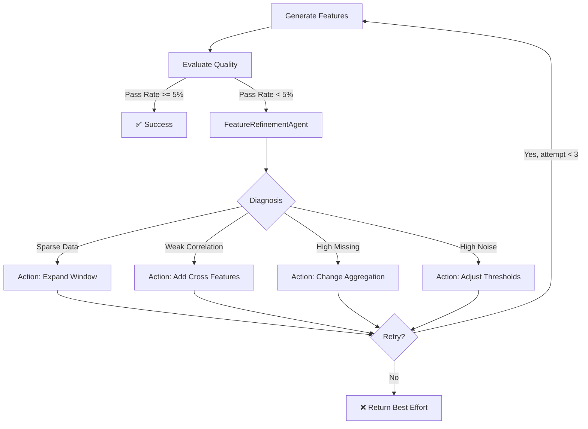

# Feature Engineering Agent Design

## 概述

特征工程是信贷风控和反欺诈建模的基础。本文档描述如何通过Agent实现**高效、可控、可解释**的自动化特征工程。

## 核心理念

**人机协同**：
- **人**：定义特征原语、时间锚点、业务规则、预算约束
- **Agent**：在约束下智能搜索、生成、筛选特征

**效率优先**：
- **三道闸门**：语义剪枝 → 代理评估 → 预算搜索
- **避免穷举**：使用 Beam Search 替代 BFS/DFS
- **成本感知**：算力预算、Token 预算、特征预算

## 特征生成效率策略

### 问题：组合爆炸

特征空间呈指数级增长：
```
主体(5) × 事件(6) × 统计量(7) × 维度(10) × 窗口(20) × 派生(5)
= 210,000 种组合
```

如果穷举生成，会导致：
- 算力浪费（大量无效特征）
- Token 消耗失控（LLM 参与枚举）
- 特征集不可维护（噪声特征过多）

### 解决方案：三道闸门（Three Gates）

```
Feature Primitives (210K candidates)
      ↓
[Gate 1] 语义剪枝 (零算力) → 50K candidates
      ↓
[Gate 2] 代理评估 (小样本) → 5K candidates
      ↓
[Gate 3] 预算搜索 (Beam Search) → 500 features
      ↓
Final Feature Set
```

**核心原则**：
> 在"真正算特征"之前，尽可能多地淘汰候选。

---

## Gate 1: 语义剪枝（零算力）

### 目标
在不扫描数据、不调用模型的前提下，过滤语义不合理的组合。

### 1.1 基于 Primitives 的硬约束

利用 `feature_primitives.yaml` 中的约束：
- 主体稳定性 vs 时间窗口
- 生命周期特征的最小窗口要求
- 统计量兼容性检查

**剪枝规则示例**：
- 低稳定性主体 + 长窗口 → 剪枝
- 不支持生命周期的主体 + 生命周期特征 → 剪枝
- 生命周期 + 离散计数统计量 → 剪枝

### 1.2 业务常识剪枝

基于领域知识的规则：

| 规则 | 原因 |
|------|------|
| `ratio × window <= 7d` | 短窗比率噪声大 |
| `device × window > 90d` | 设备稳定性不足 |
| `lifecycle × window < 90d` | 生命周期需要足够历史 |
| `network × realtime` | 图计算不适合实时 |
| `mom × window < 30d` | 环比需要足够历史 |

### 1.3 剪枝效果

- 输入：210,000 候选
- 输出：50,000 候选（剪枝 76%）
- 成本：零算力、零 Token

---

## Gate 2: 代理评估（小样本）

### 目标
在不进行全量计算的前提下，判断候选特征是否值得投入算力。

### 2.1 小样本策略

**采样方法**：
- 随机抽样 1-5% 样本
- 仅计算最近 30/60 天
- 仅计算 Top-N 活跃主体

**快速统计指标**：
- 缺失率（missing_rate）
- 方差（variance）
- 分布熵（entropy）
- 分位数坍缩度（quantile_collapse）
- 时间一致性（temporal_consistency）

### 2.2 快速淘汰规则

- 缺失率 > 80% → 淘汰
- 方差接近 0 → 淘汰（无信息量）
- 分位数坍缩 > 90% → 淘汰（信息量低）
- 时间一致性 < 30% → 淘汰（不稳定）

### 2.3 代理评估效果

- 输入：50,000 候选
- 输出：5,000 候选（剪枝 90%）
- 成本：小样本计算（1-5% 算力）

---

## Gate 3: 预算搜索（Beam Search）

### 目标
在算力预算内，使用 Beam Search 找到最优特征子集。

### 3.1 特征预算配置

在 `feature_primitives.yaml` 中定义：
- 总特征数上限
- 每个主体的预算
- 每个特征族的预算
- 每个窗口类型的预算

### 3.2 Beam Search 策略

**禁止穷举**，使用 Beam Search：

1. **第一轮**：生成基础特征，按代理分数保留 Top-K
2. **第二轮**：在 Top-K 上派生（ratio, trend）
3. **第三轮**：全量精算 Top-K
4. **应用预算**：按重要性排序，应用预算约束

### 3.3 搜索效果

- 输入：5,000 候选
- 输出：500 特征（符合预算）
- 复杂度：O(K × depth) vs 穷举 O(N^4)

---

## LLM / Token 成本控制

### 原则1：LLM 只参与决策，不参与枚举

**错误方式**：让 LLM 枚举所有组合
**正确方式**：程序枚举 + LLM 决策关键节点

### 原则2：结构化摘要输入

**错误方式**：输入 SQL、原始数据
**正确方式**：输入结构化摘要（特征名、代理指标、统计摘要）

---

## 真实场景特征模式分析

基于真实信贷模型（426个入模变量）的分析，发现以下关键设计模式：

### 1. 特征命名的结构化模式

**标准命名模板**：`{主体}_{计算方式}_{统计量}_{对象}_{事件类型}_{维度}_{时间窗口}`

#### 命名模板详解

**完整示例**：
```
i_ratio_cnt_partner_loan_bank_365d
│   │     │   │       │    │    │
│   │     │   │       │    │    └─ [6] 时间窗口
│   │     │   │       │    └─ [5] 维度/分组（可选）
│   │     │   │       └─ [4] 事件类型（可选）
│   │     │   └─ [3] 统计对象
│   │     └─ [2] 统计量
│   └─ [1] 计算方式（可选）
└─ [0] 主体
```

**各部分说明**：

**[0] 主体 (Subject)** - 必选
- `i_` - 身份证 (ID card)
- `m_` - 手机号 (Mobile)
- `d_` - 设备 (Device)
- `u_` - 用户 (User)
- `ip_` - IP地址 (IP address)

**[1] 计算方式 (Calculation Method)** - 可选
- `ratio_` - 比率/占比
- `mean_` - 平均值
- `max_` - 最大值
- `min_` - 最小值
- `std_` - 标准差
- `sum_` - 求和
- `mom_` - 环比 (Month-over-Month)
- `yoy_` - 同比 (Year-over-Year)
- `grad_` - 变化度/梯度
- `slope_` - 斜率
- `incr_` - 增量
- `diff_` - 差异

**[2] 统计量 (Metric)** - 必选
- `cnt_` - 数量 (count)
- `freq_` - 频次 (frequency)
- `amt_` - 金额 (amount)
- `duration_` - 持续时间
- `interval_` - 间隔
- `rate_` - 比率

**[3] 统计对象 (Object)** - 必选
- `user` - 用户
- `partner` - 合作方/机构
- `device` - 设备
- `ip` - IP地址
- `account` - 账户
- `order` - 订单
- `session` - 会话
- `country` - 国家
- `city` - 城市
- `province` - 省份

**[4] 事件类型 (Event Type)** - 可选
- `txn` - 交易事件
- `loan` - 贷款/申贷事件
- `login` - 登录事件
- `register` - 注册事件
- `withdraw` - 提现事件
- `repay` - 还款事件

**[5] 维度/分组 (Dimension)** - 可选
- 行业维度：`bank`, `fintech`, `ecommerce`
- 产品维度：`product_a`, `product_b`
- 渠道维度：`online`, `offline`
- 风险维度：`high_risk`, `low_risk`
- 时间维度：`weekday`, `weekend`, `night`
- 加权方式：`weighted`, `decay`

**[6] 时间窗口 (Time Window)** - 必选
- 秒级别：`30s`, `60s`, `300s` (反欺诈实时检测)
- 分钟级别：`5m`, `10m`, `30m`, `60m` (反欺诈短期行为)
- 小时级别：`1h`, `3h`, `6h`, `12h`, `24h` (反欺诈当日行为)
- 天级别：`1d`, `3d`, `7d`, `15d`, `30d`, `60d`, `90d`, `180d`, `365d`
- 周级别（日历周）：`1w`, `2w`, `4w`, `12w`, `26w`, `52w`
- 月级别（日历月）：`1mo`, `3mo`, `6mo`, `12mo`, `18mo`, `24mo`, `36mo`
- 年级别（日历年）：`1y`, `2y`, `3y`, `5y`

#### 命名模式示例

**基础统计特征**：
```
i_cnt_partner_loan_bank_365d
# 身份证 + 数量 + 合作方 + 贷款事件 + 银行维度 + 365天
# = 身份证在365天内银行类贷款事件的合作方数量

m_freq_login_30d
# 手机号 + 频次 + 登录事件 + 30天
# = 手机号在30天内的登录频次

u_amt_txn_90d
# 用户 + 金额 + 交易事件 + 90天
# = 用户在90天内的交易金额

i_cnt_device_loan_180d
# 身份证 + 数量 + 设备 + 贷款事件 + 180天
# = 身份证在180天内贷款事件使用的设备数量
```

**比率特征**：
```
i_ratio_cnt_partner_bank_365d
# 身份证 + 比率 + 数量 + 合作方 + 银行维度 + 365天
# = 身份证在365天内银行类合作方数量占总合作方数量的比率

m_ratio_freq_login_night_30d
# 手机号 + 比率 + 频次 + 登录 + 夜间维度 + 30天
# = 手机号在30天内夜间登录频次占总登录频次的比率
```

**趋势特征**：
```
i_mom_cnt_partner_90d
# 身份证 + 环比 + 数量 + 合作方 + 90天
# = 身份证在90天内合作方数量的环比变化

m_grad_amt_txn_180d
# 手机号 + 变化度 + 金额 + 交易 + 180天
# = 手机号在180天内交易金额的变化度（梯度）

u_incr_cnt_device_30d
# 用户 + 增量 + 数量 + 设备 + 30天
# = 用户在30天内新增设备数量

i_slope_cnt_loan_365d
# 身份证 + 斜率 + 数量 + 贷款 + 365天
# = 身份证在365天内贷款数量的斜率
```

**加权特征**：
```
i_cnt_partner_loan_weighted_365d
# 身份证 + 数量 + 合作方 + 贷款事件 + 加权维度 + 365天
# = 身份证在365天内贷款事件合作方数量（时间加权）
# 加权方式：线性衰减，近期权重高，远期权重低

m_amt_txn_decay_90d
# 手机号 + 金额 + 交易事件 + 衰减维度 + 90天
# = 手机号在90天内交易金额（指数衰减加权）
# 加权方式：指数衰减，权重 = e^(-λt)

i_cnt_loan_loan_weighted_180d
# 身份证 + 数量 + 贷款 + 贷款事件 + 加权维度 + 180天
# = 身份证在180天内贷款数量（时间加权）
```

**加权说明**：
- **线性衰减** (`weighted`)：权重 = 1 - (t / T)，t为距今天数，T为窗口总天数
  - 今天：权重 = 1.0
  - 30天前：权重 = 0.92 (假设90天窗口)
  - 90天前：权重 = 0.0

- **指数衰减** (`decay`)：权重 = e^(-λt)，λ为衰减系数
  - 今天：权重 = 1.0
  - 30天前：权重 = 0.37 (λ=0.033)
  - 90天前：权重 = 0.05

- **业务价值**：近期行为比历史行为更能预测未来风险

**跨窗口对比特征**：
```
i_diff_cnt_partner_30d_90d
# 身份证 + 差异 + 数量 + 合作方 + 30天对比90天
# = 身份证在30天和90天内合作方数量的差异

m_ratio_amt_txn_7d_30d
# 手机号 + 比率 + 金额 + 交易 + 7天对比30天
# = 手机号在7天和30天内交易金额的比率

i_diff_cnt_loan_loan_30d_90d
# 身份证 + 差异 + 数量 + 贷款 + 贷款事件 + 30天对比90天
# = 身份证在30天和90天内贷款数量的差异

i_yoy_amt_txn_1y
# 身份证 + 同比 + 金额 + 交易事件 + 1年
# = 身份证交易金额的同比变化（本年vs去年同期）

m_mom_cnt_loan_loan_1mo
# 手机号 + 环比 + 数量 + 贷款 + 贷款事件 + 1月
# = 手机号贷款数量的环比变化（本月vs上月）
```

**反欺诈短时窗口特征**：
```
u_cnt_login_10m
# 用户 + 数量 + 登录事件 + 10分钟
# = 用户在10分钟内的登录次数

i_cnt_device_loan_1h
# 身份证 + 数量 + 设备 + 贷款事件 + 1小时
# = 身份证在1小时内贷款事件使用的设备数量

m_freq_txn_5m
# 手机号 + 频次 + 交易事件 + 5分钟
# = 手机号在5分钟内的交易频次

u_cnt_city_login_30m
# 用户 + 数量 + 城市 + 登录事件 + 30分钟
# = 用户在30分钟内登录事件出现的城市数量

ip_cnt_user_login_1h
# IP地址 + 数量 + 用户 + 登录事件 + 1小时
# = IP地址在1小时内登录事件关联的用户数量

ip_freq_login_10m
# IP地址 + 频次 + 登录事件 + 10分钟
# = IP地址在10分钟内的登录频次

i_cnt_loan_loan_1h
# 身份证 + 数量 + 贷款 + 贷款事件 + 1小时
# = 身份证在1小时内的贷款申请数量

i_cnt_country_txn_1h
# 身份证 + 数量 + 国家 + 交易事件 + 1小时
# = 身份证在1小时内交易事件出现的国家数量（跨国异常检测）

i_ratio_cnt_device_loan_1h_24h
# 身份证 + 比率 + 数量 + 设备 + 贷款事件 + 1小时对比24小时
# = 身份证在1小时和24小时内贷款事件设备数量的比率（异常激增检测）

m_mom_cnt_txn_10m_1h
# 手机号 + 环比 + 数量 + 交易事件 + 10分钟对比1小时
# = 手机号在10分钟和1小时内交易数量的环比（突发行为检测）

ip_ratio_cnt_user_login_1h_24h
# IP地址 + 比率 + 数量 + 用户 + 登录事件 + 1小时对比24小时
# = IP地址在1小时和24小时内登录事件用户数量的比率（IP共享异常检测）

i_ratio_cnt_loan_loan_1h_24h
# 身份证 + 比率 + 数量 + 贷款 + 贷款事件 + 1小时对比24小时
# = 身份证在1小时和24小时内贷款数量的比率（贷款欺诈检测）

m_cnt_province_txn_24h
# 手机号 + 数量 + 省份 + 交易事件 + 24小时
# = 手机号在24小时内交易事件出现的省份数量（地理位置跳变检测）
```

#### 命名规则总结

**必选部分**（3个）：
1. **主体** (Subject) - 特征属于谁
2. **统计量 + 对象** (Metric + Object) - 统计什么
3. **时间窗口** (Time Window) - 统计多长时间

**可选部分**（2个）：
1. **计算方式** (Calculation Method) - 如何计算（默认为直接统计）
2. **维度/分组** (Dimension) - 在什么维度上统计

**命名原则**：
1. **从左到右，从粗到细**：主体 → 计算方式 → 统计内容 → 维度 → 时间
2. **可读性优先**：每个部分都有明确含义，用下划线分隔
3. **可解析性**：可以通过分隔符拆解，自动反推计算逻辑
4. **唯一性**：不同特征必然有不同命名
5. **简洁性**：避免冗余信息，使用标准缩写
6. **加权标记兼容**：标准用 `weighted/decay` 作为维度，历史特征可能使用 `*_weight_*` 前缀，命名标准化工具需兼容

**时间窗口标准化**：
- 使用标准单位：`s` (second), `m` (minute), `h` (hour), `d` (day), `w` (week), `mo` (month), `y` (year)
- 避免混用长短格式，统一使用短格式
- 跨窗口对比使用 `_` 连接：`30d_90d`, `10m_1h`, `1mo_3mo`
- 反欺诈场景优先使用秒/分钟/小时级窗口
- 信贷场景优先使用天/周/月/年级窗口
- **日历单位说明**：
  - `w` (week) - 自然周，从周一到周日
  - `mo` (month) - 自然月，从月初到月末
  - `y` (year) - 自然年，从年初到年末
  - 日历单位适用于周期性分析、同比环比计算

**Agent设计启示**：
- 需要实现**特征命名生成器**，根据原语自动生成规范命名
- 需要**特征解析器**，从命名反推特征计算逻辑
- 需要**命名冲突检测**，避免重复特征
- 需要**命名验证器**，确保命名符合规范
- 需要**命名标准化工具**，统一历史特征命名格式

### 2. 多主体关联模式

**发现**：同一特征在不同主体（身份证/手机号/设备/IP）上都有计算

**价值**：
- 身份证特征：稳定性高，难以篡改
- 手机号特征：捕捉短期行为变化
- 设备特征：识别设备指纹和共享设备
- IP特征：识别代理IP、IP共享、地理位置异常
- 交叉验证：多个主体特征不一致时可能存在欺诈

**Agent设计启示**：
- 特征生成需要支持**多主体并行计算**
- 需要**主体一致性检测工具**：`DetectSubjectInconsistencyTool`
- 示例：
  - `i_cnt_partner_365d` vs `m_cnt_partner_365d` 差异过大时预警
  - `ip_cnt_user_1h` 过高时识别IP共享或代理
  - `d_cnt_user_24h` 过高时识别设备共享

### 3. 多时间窗口组合模式

**发现**：不同业务场景需要不同粒度的时间窗口

**信贷场景**：11个时间窗口（7/10/30/60/90/180/270/360/365/730/1095天）
- 短期窗口（7-30天）：捕捉紧急行为
- 中期窗口（90-365天）：捕捉常态行为
- 长期窗口（730-1095天）：捕捉生命周期模式

**反欺诈场景**：需要更细粒度的时间窗口
- 实时窗口（30秒-5分钟）：捕捉异常突发行为
- 短期窗口（10分钟-1小时）：捕捉短期异常模式
- 当日窗口（1小时-24小时）：捕捉当日行为特征
- 近期窗口（1-7天）：捕捉近期风险信号

**价值**：
- 不同时间粒度捕捉不同风险信号
- 窗口对比特征：识别"突然激增"、"异常加速"
- 跨粒度组合：`10min vs 1h`、`1h vs 24h`、`1d vs 7d`

**Agent设计启示**：
- 需要**智能窗口选择器**：根据业务场景（信贷/反欺诈）推荐窗口组合
- 需要**窗口对比特征生成器**：自动生成跨窗口对比特征
- 需要**窗口性能优化**：
  - 短窗口（秒/分钟级）：使用流式计算、滑动窗口
  - 长窗口（天/月级）：使用批量计算、增量更新
- 需要**实时计算支持**：反欺诈场景需要毫秒级响应

### 4. 生命周期特征模式（核心，占52.3%）

**发现**：将时间序列分解为上升期/下降期/稳定期/休眠期

**价值**：
- 比简单统计更能反映用户行为模式
- 捕捉"异常激增"、"突然沉默"等风险信号
- 符合信贷业务对"多头借贷生命周期"的理解

**Agent设计启示**：
- 需要**生命周期分解算法**：`LifecyclePeriodDetectionTool`
- 需要为每个周期计算统计量：`mean_k_down_life_period`（下降期斜率）
- 需要计算周期特征：个数、持续时长、间隔、组合模式

### 5. 复杂网络特征模式（占7.3%）

**发现**：基于图结构的关联分析

**价值**：
- 一度/二度关联：发现隐藏关系
- 社群分析：识别团伙欺诈
- 风险传播：关联节点的风险标签

**Agent设计启示**：
- 需要**图计算工具**：`ComputeNetworkFeaturesTool`
- 需要支持：节点度数、社群检测、标签传播、PageRank等算法
- 需要与主流图数据库集成（Neo4j、JanusGraph）

### 6. 行业细分模式

**发现**：9种行业分类 + 全行业

**价值**：
- 不同行业风险特征不同
- 行业占比反映用户偏好
- 行业切换反映风险变化

**Agent设计启示**：
- 需要**行业维度配置化**：支持自定义行业分类
- 需要**行业占比自动计算**：`ratio_cnt_partner_Bank` / `ratio_cnt_partner_all`
- 需要**行业偏好度计算**：TF-IDF算法

### 7. 趋势特征模式（占4.9%）

**发现**：环比(mom)、斜率(slope)、变化度(gradient)、增量(incr)

**价值**：
- 捕捉行为变化趋势
- 识别"突然激增"风险信号
- 比静态统计更有预测力

**Agent设计启示**：
- 需要**时间序列分析工具**：`ComputeTrendFeaturesTool`
- 需要支持：环比、同比、移动平均、指数平滑
- 需要**异常检测**：识别突变点

### 8. 加权统计模式

**发现**：`weight`、`wcInterestLevel` 等时间加权特征

**价值**：
- 近期行为权重更高
- 符合"近期行为更能预测未来"的假设

**Agent设计启示**：
- 需要**加权函数配置**：线性衰减、指数衰减、自定义
- 需要在所有统计量上支持加权：`cnt_weight`, `freq_weight`, `mean_weight`

### 9. 第三方数据集成模式

**发现**：426个特征全部来自第三方（同盾）

**价值**：
- 第三方数据覆盖面广
- 专业风控数据源
- 但需要成本和接口对接

**Agent设计启示**：
- 需要**第三方数据源适配器**：统一接口
- 需要**数据源成本管理**：记录每个特征的调用成本
- 需要**数据源质量监控**：缺失率、延迟、准确性

### 10. 特征重要性分布模式

**发现**：
- Top 1特征（反欺诈评分）重要性 = 14209
- Top 2-4特征（标准评分）重要性 = 1149/677/179
- Top 5-10特征（衍生特征）重要性 = 111/109/86/84/72/67

**价值**：
- 第三方评分特征最重要（占据Top 4）
- 但衍生特征数量多，累计贡献大
- 长尾特征也有价值（426个特征都入模）

**Agent设计启示**：
- 需要**特征重要性追踪**：记录每个特征的gain/split
- 需要**特征分层管理**：核心特征、重要特征、辅助特征
- 需要**特征裁剪策略**：基于重要性阈值自动裁剪

## 架构设计

### 四层架构（基于真实场景优化）

```
┌─────────────────────────────────────────────────────────┐
│  特征原语层 (Feature Primitives)                         │
│  - 主体定义 (身份证/手机号)                               │
│  - 时间锚点 + 多窗口组合                                  │
│  - 行业/产品/利率等维度定义                               │
│  - 统计量类型 (基础/比率/趋势/生命周期)                   │
│  - 命名规范生成器                                         │
└─────────────────────────────────────────────────────────┘
              ↓
┌─────────────────────────────────────────────────────────┐
│  特征生成层 (Feature Generation)                         │
│  - 多主体并行计算                                         │
│  - 窗口统计特征 (基础聚合)                                │
│  - 生命周期特征 (周期分解 + 统计)                         │
│  - 趋势特征 (环比/斜率/变化度)                            │
│  - 网络特征 (图计算)                                      │
│  - 加权特征 (时间衰减)                                    │
│  - 跨维度特征 (行业占比/窗口对比)                         │
└─────────────────────────────────────────────────────────┘
              ↓
┌─────────────────────────────────────────────────────────┐
│  特征筛选层 (Feature Selection)                          │
│  - 数据质量检查 (缺失率/覆盖率/单值)                      │
│  - 单变量效果 (IV/KS)                                     │
│  - 稳定性检验 (PSI)                                       │
│  - 共线性检测                                             │
│  - 主体一致性检测                                         │
│  - 业务合理性验证                                         │
└─────────────────────────────────────────────────────────┘
              ↓
┌─────────────────────────────────────────────────────────┐
│  特征管理层 (Feature Management)                         │
│  - 特征重要性追踪                                         │
│  - 特征血缘关系                                           │
│  - 特征成本管理 (第三方数据)                              │
│  - 特征版本控制                                           │
│  - 特征文档自动生成                                       │
└─────────────────────────────────────────────────────────┘
```

## 核心工具设计

### 1. DefineFeaturePrimitivesTool

**目的**：定义特征工程的基础规则和约束

**输入**：
```typescript
{
  anchorTime: string              // 时间锚点字段

  // 多主体支持
  subjects: {
    type: string                  // 'id_card' | 'mobile' | 'device'
    prefix: string                // 'i_' | 'm_' | 'd_'
    joinKey?: string              // 关联字段
  }[]

  // 时间窗口（默认单位: day）
  windows: number[]               // [7, 30, 90]

  // 行为类型定义（可按行为配置维度）
  behaviorTypes: {
    name: string                  // 行为名称 (e.g., 'login', 'transaction')
    table: string                 // 数据表
    timestampColumn: string       // 时间戳字段
    valueColumn?: string          // 数值字段 (可选)
    categoryColumn?: string       // 分类字段 (可选)
    dimensions?: {                // 行为级维度 (可选)
      industry?: string[]         // 行业维度
      productType?: string[]      // 产品类型
      interestLevel?: string[]    // 利率档位
      riskLabel?: string[]        // 风险标签
      custom?: Record<string, string[]>  // 自定义维度
    }
  }[]

  // 维度定义（全局可选，行为级 dimensions 优先）
  dimensions?: {
    industry?: string[]           // 行业维度
    productType?: string[]        // 产品类型
    interestLevel?: string[]      // 利率档位
    riskLabel?: string[]          // 风险标签
    custom?: Record<string, string[]>  // 自定义维度
  }

  // 统计量类型
  aggregations: {
    basic: string[]               // count, sum, mean, max, min, std
    ratio?: string[]              // ratio, rate
    trend?: string[]              // mom, gradient, slope, incr
    weighted?: string[]           // weighted, decay
    lifecycle?: string[]          // life period types
    network?: string[]            // network algorithms
    distribution?: string[]       // tfidf, etc.
  }

  // 命名规范
  namingConvention?: {
    template: string              // 命名模板
    separator: string             // 分隔符 (default: '_')
    maxLength: number             // 最大长度
  }

  constraints: {
    maxFeatures?: number
    minSampleSize?: number
    excludeColumns?: string[]
    realtime?: boolean
  }
}
```

**输出**：
```typescript
{
  primitiveId: string
  summary: {
    totalCombinations: number
    estimatedFeatures: number
    featuresByType: Record<string, number>  // 按类型统计
  },
  namingRules: {
    pattern: string
    examples: string[]
  }
}
```

---

### 2. SemanticPruningTool（Gate 1）

**目的**：语义剪枝，在零算力下过滤不合理组合

**输入**：
```typescript
{
  primitiveId: string
  candidates: FeatureCandidate[]  // 候选特征列表
  pruningRules: {
    hardConstraints: boolean      // 启用硬约束剪枝
    businessRules: boolean        // 启用业务规则剪枝
    customRules?: PruningRule[]   // 自定义规则
  }
}

interface FeatureCandidate {
  subject: string
  event?: string
  metric: string
  object: string
  calculation?: string
  dimension?: string
  window: string
}

interface PruningRule {
  condition: (f: FeatureCandidate) => boolean
  reason: string
  action: 'PRUNE' | 'WARN'
}
```

**输出**：
```typescript
{
  passed: FeatureCandidate[]      // 通过剪枝的候选
  pruned: {
    candidate: FeatureCandidate
    reason: string
    rule: string
  }[]
  statistics: {
    totalInput: number
    totalPassed: number
    totalPruned: number
    pruneRate: number
    prunedByHardConstraints: number
    prunedByBusinessRules: number
  }
}
```

---

### 3. ProxyEvaluationTool（Gate 2）

**目的**：小样本代理评估，快速淘汰低质量候选

**输入**：
```typescript
{
  primitiveId: string
  datasource: string
  sampleTable: string
  candidates: FeatureCandidate[]
  samplingStrategy: {
    method: 'random' | 'recent' | 'active'  // 采样方法
    sampleRate: number                      // 采样比例 (0.01-0.05)
    timeRange?: string                      // 时间范围 (e.g., '30d')
    topN?: number                           // Top-N 活跃主体
  }
  thresholds: {
    max_missing_rate: number                // 最大缺失率 (default: 0.8)
    min_variance: number                    // 最小方差 (default: 1e-6)
    min_entropy: number                     // 最小熵 (default: 1.0)
    max_quantile_collapse: number           // 最大分位数坍缩 (default: 0.9)
    min_temporal_consistency: number        // 最小时间一致性 (default: 0.3)
  }
}
```

**输出**：
```typescript
{
  passed: {
    candidate: FeatureCandidate
    proxyMetrics: {
      missing_rate: number
      coverage: number
      variance: number
      entropy: number
      quantile_collapse: number
      temporal_consistency: number
    }
    proxyScore: number                      // 综合代理分数 (0-1)
  }[]
  rejected: {
    candidate: FeatureCandidate
    reason: string
    failedMetric: string
  }[]
  statistics: {
    totalInput: number
    totalPassed: number
    totalRejected: number
    rejectRate: number
    computeCost: number                     // 计算成本（相对全量）
  }
}
```

---

### 4. BeamSearchFeaturesTool（Gate 3）

**目的**：预算约束下的 Beam Search 特征生成

**输入**：
```typescript
{
  primitiveId: string
  datasource: string
  sampleTable: string
  candidates: FeatureCandidate[]            // 通过 Gate 2 的候选
  beamWidth: number                         // Beam 宽度 (default: 50)
  budget: {
    total: number                           // 总特征数上限
    per_subject?: Record<string, number>    // 每个主体的预算
    per_family?: Record<string, number>     // 每个特征族的预算
    per_window?: Record<string, number>     // 每个窗口类型的预算
  }
  searchStrategy: {
    rounds: number                          // 搜索轮数 (default: 3)
    derivation: boolean                     // 是否派生特征 (ratio, trend)
    crossFeatures: boolean                  // 是否生成交叉特征
  }
}
```

**输出**：
```typescript
{
  selectedFeatures: {
    name: string
    formula: string
    importance: number
    family: string
    subject: string
    window: string
  }[]
  searchTrace: {
    round: number
    candidates: number
    selected: number
    topFeatures: string[]
  }[]
  budgetUsage: {
    total: { used: number, limit: number }
    per_subject: Record<string, { used: number, limit: number }>
    per_family: Record<string, { used: number, limit: number }>
    per_window: Record<string, { used: number, limit: number }>
  }
  statistics: {
    totalCandidates: number
    finalFeatures: number
    selectionRate: number
    computeCost: string                     // 相对穷举的成本
  }
}
```

---

### 5. GenerateWindowFeaturesTool

**目的**：基于定义的原语自动生成时间窗口统计特征

**输入**：
```typescript
{
  primitiveId: string             // 原语配置ID
  datasource: string              // 数据源
  sampleTable: string             // 样本表 (包含anchor_time和样本ID)
  outputTable?: string            // 输出表名 (可选，默认临时表)
  parallel?: boolean              // 是否并行计算 (default: true)
}
```

**输出**：
```typescript
{
  outputTable: string             // 生成的特征表
  features: {
    name: string                  // 特征名称
    description: string           // 特征描述
    type: 'numeric' | 'categorical'
    formula: string               // 计算公式
    reasoning?: string            // 特征业务解释（可选）
  }[]
  statistics: {
    totalGenerated: number        // 生成特征数
    executionTime: number         // 执行时间(秒)
    sampleSize: number            // 样本量
  }
}
```

---

### 3. GenerateLifecycleFeaturesTool（核心）

**目的**：生成生命周期特征（占真实模型52.3%），支持参数自适应

**输入**：
```typescript
{
  primitiveId: string
  datasource: string
  sampleTable: string
  metric: string                  // 用于判断周期的指标 (e.g., 'partner_count')
  algorithm: {
    method: 'threshold' | 'changepoint' | 'hmm'  // 周期检测算法
    params: Record<string, any>
    autoTune?: boolean            // 是否启用参数自适应 (default: false)
    optimizationMetric?: 'iv' | 'auc' | 'ks'  // 优化目标 (启用autoTune时必需)
  }
}
```

**输出**：
```typescript
{
  features: {
    // 周期个数
    cnt_up_life_period
    cnt_down_life_period
    cnt_stable_life_period
    cnt_zero_life_period

    // 周期统计
    mean_k_up_life_period          // 上升期斜率均值
    mean_freq_record_stable_life_period  // 稳定期记录数均值
    max_duration_month_zero_life_period  // 休眠期最大持续月数

    // 周期组合
    cnt_up_down_life_period        // 上升-下降组合次数
    ratio_cnt_down_life_period     // 下降期占比
  }[]

  // 参数自适应结果（如果启用）
  tuningResult?: {
    bestParams: Record<string, any>
    optimizationScore: number
    searchHistory: {
      params: Record<string, any>
      score: number
    }[]
  }
}
```

---

### 4. ComputeNetworkFeaturesTool

**目的**：生成复杂网络特征（占真实模型7.3%），支持时序图分析

**输入**：
```typescript
{
  graphSource: string             // 图数据源
  nodeType: string                // 节点类型
  relationTypes: string[]         // 关系类型
  algorithms: {
    degree: boolean               // 度数统计
    community: boolean            // 社群检测
    labelPropagation: boolean     // 标签传播
    pagerank: boolean             // PageRank
    temporal?: {                  // 时序图分析（可选）
      enabled: boolean
      changeInCentrality: boolean  // 中心度变化率
      communityEvolution: boolean  // 社群演变
      dynamicLinkPrediction: boolean  // 动态链接预测
    }
  }
  timeWindows?: number[]          // 时间窗口（用于时序分析）
}
```

**输出**：
```typescript
{
  features: {
    // 静态网络特征
    cnt_node_dist1                // 一度关联节点数
    cnt_node_dist2                // 二度关联节点数
    is_grey_node                  // 是否灰名单节点

    // 社群特征
    cnt_grp_partner               // 社群合作方数
    ratio_cnt_grp_id              // 社群身份证数占比
    ratio_cnt_grp_reject_review   // 社群拒绝审核占比

    // 风险传播
    cnt_node_dist1_grey           // 一度关联灰名单数
    ratio_cnt_node_reject         // 关联节点拒绝占比

    // 时序网络特征（如果启用）
    change_in_centrality_30d      // 30天中心度变化率
    community_split_cnt_90d       // 90天社群分裂次数
    community_merge_cnt_90d       // 90天社群合并次数
    predicted_link_risk_score     // 预测链接风险分
  }[]
}
```

---

### 5. GenerateTrendFeaturesTool

**目的**：生成趋势特征（占真实模型4.9%）

**输入**：
```typescript
{
  featureTable: string
  baseFeatures: string[]          // 基础特征
  trendTypes: {
    mom: boolean                  // 环比 (Month-over-Month)
    gradient: boolean             // 变化度
    slope: boolean                // 斜率
    incr: boolean                 // 增量
  },
  windowPairs: [number, number][] // 窗口对比 [[30, 90], [180, 365]]
}
```

**输出**：
```typescript
{
  features: {
    // 环比特征
    mom_cnt_90daypartner_v4_all_all_360day  // 360天内90日平台数环比

    // 变化度特征
    gradient_cnt_partner_weight_clt1v4_Loan_all_1095day  // 时间加权月申贷机构数变化度

    // 斜率特征
    slope_freq_record_weight_clt1v4_Loan_Consumfin_365day  // 月申请次数斜率

    // 增量特征
    incr_set_recent90daypartner_v4_all_LoanAssistPlat_270day  // 近90日新增平台数
  }[]
}
```

---

### 5. GenerateWeightedFeaturesTool（新增）

**目的**：生成时间加权特征

**输入**：
```typescript
{
  featureTable: string
  baseFeatures: string[]
  weightFunction: {
    type: 'linear' | 'exponential' | 'custom'
    decay: number                 // 衰减系数
  }
}
```

**输出**：
```typescript
{
  features: {
    cnt_weight_interestLevel_two_clt1v4_Loan_all_1095day  // 时间加权申请机构数
    freq_weight_interestLevel_three_clt1v4_Loan_all_730day  // 时间加权申请次数
  }[]
}
```

---

### 6. GenerateCrossFeaturesTool

**目的**：生成交叉特征，支持语义校验

**输入**：
```typescript
{
  featureTable: string
  crossRules: {
    features: string[]            // 要交叉的特征
    method: 'multiply' | 'divide' | 'subtract' | 'interaction'
    name?: string
  }[]
  maxOrder?: number               // 最大交叉阶数 (default: 2)
  autoSelect?: boolean            // 自动选择高IV特征交叉 (default: true)
  semanticValidation?: boolean    // 启用语义校验 (default: false)
}
```

**输出**：
```typescript
{
  features: {
    name: string
    formula: string
    baseFeatures: string[]
    semanticScore?: number        // 语义合理性评分 (0-1)
    reasoning?: string            // 交叉特征的业务解释
  }[]
  addedCount: number
  rejectedBySemantic?: number     // 被语义校验拒绝的数量
}
```

**语义校验示例**：
```typescript
// ✅ 通过语义校验
{
  name: "income_loan_ratio",
  formula: "income / loan_amount",
  reasoning: "收入与贷款金额的比率，反映负债能力，比率越高风险越低"
}

// ❌ 被语义校验拒绝
{
  name: "height_interest_product",
  formula: "height * interest_rate",
  reasoning: "身高与利率的乘积无业务含义，被拒绝"
}
```

---

### 7. DetectSubjectInconsistencyTool

**目的**：检测多主体特征不一致性（反欺诈）

**输入**：
```typescript
{
  featureTable: string
  subjectPairs: ['i_', 'm_'][]    // 主体对
  threshold: number               // 不一致阈值
}
```

**输出**：
```typescript
{
  inconsistencies: {
    feature: string
    idCardValue: number
    mobileValue: number
    diff: number
    diffRate: number
    suspicious: boolean
  }[]
}
```

---

### 8. GenerateFeatureDocumentationTool

**目的**：自动生成特征文档，包含业务解释

**输入**：
```typescript
{
  features: string[]
  includeFormula: boolean
  includeStatistics: boolean
  includeBusinessMeaning: boolean
  autoReasoning?: boolean         // 使用LLM自动生成业务解释 (default: false)
}
```

**输出**：
```typescript
{
  documentation: {
    feature: string
    name: string                  // 解析后的可读名称
    formula: string               // 计算公式
    dataSource: string            // 数据来源
    updateFrequency: string       // 更新频率
    businessMeaning: string       // 业务含义
    riskHypothesis?: string       // 风险假设（autoReasoning启用时）
    importance: number            // 重要性
    cost: number                  // 计算成本
  }[]
}
```

**自动推理示例**：
```typescript
{
  feature: "i_ratio_cnt_loan_1h_24h",
  riskHypothesis: "该特征捕捉了短期内的突发借贷行为。在历史欺诈样本中，欺诈分子往往会在短时间内高频攻击，因此该比率飙升通常意味着高风险。"
}
```

---

### 9. TargetEncodingTool（新增）

**目的**：处理高基数类别特征，防止数据泄漏

**输入**：
```typescript
{
  featureTable: string
  categoricalFeatures: string[]   // 类别特征列表
  target: string                  // 目标变量
  method: 'mean' | 'woe' | 'frequency'
  smoothing?: number              // 平滑参数 (default: 1.0)
  kfold?: number                  // K折交叉编码 (default: 5)
}
```

**输出**：
```typescript
{
  encodedFeatures: {
    original: string
    encoded: string               // 编码后的特征名
    mapping: Record<string, number>
  }[]
  leakageCheck: {
    passed: boolean
    warnings: string[]
  }
}
```

---

### 10. EmbeddingTool（新增）

**目的**：处理序列和文本特征

**输入**：
```typescript
{
  featureTable: string
  sequenceFeatures: {
    name: string                  // 特征名 (e.g., 'app_list', 'device_model')
    type: 'sequence' | 'text'
    embeddingModel?: string       // 预训练模型 (default: 'bert-base')
    dimension?: number            // 嵌入维度 (default: 128)
  }[]
}
```

**输出**：
```typescript
{
  embeddingFeatures: {
    original: string
    embeddings: string[]          // 嵌入特征名列表 (e.g., 'app_list_emb_0', 'app_list_emb_1', ...)
    dimension: number
  }[]
}
```

---

### 11. CostAwareSelectionTool（新增）

**目的**：成本感知的特征筛选

**输入**：
```typescript
{
  featureTable: string
  features: {
    name: string
    cost: number                  // 特征成本（元/次）
    source: 'internal' | 'external'
  }[]
  target: string
  budget?: number                 // 预算限制（元/样本）
  correlationThreshold?: number   // 相关性阈值 (default: 0.95)
}
```

**输出**：
```typescript
{
  selectedFeatures: string[]
  costSavings: {
    originalCost: number
    optimizedCost: number
    savings: number
    savingsRate: number
  }
  replacements: {
    expensive: string             // 被替换的付费特征
    cheap: string                 // 替换的免费特征
    correlation: number
    costSaved: number
  }[]
}
```

---

### 12. FeatureRefinementAgent（新增）

**目的**：特征质量不达标时的自动诊断和重构

**输入**：
```typescript
{
  primitiveId: string
  featureTable: string
  qualityReport: {
    totalGenerated: number
    passedSelection: number
    failureReasons: {
      lowIV: number
      highPSI: number
      highMissing: number
      highCollinearity: number
    }
  }
  target: string
}
```

**输出**：
```typescript
{
  diagnosis: {
    rootCause: string             // 根本原因分析
    recommendations: {
      action: 'expand_window' | 'change_aggregation' | 'add_cross' | 'adjust_threshold'
      reason: string
      expectedImprovement: string
    }[]
  }
  refinedPrimitives?: {
    primitiveId: string
    changes: string[]
  }
  shouldRetry: boolean
}
```

**诊断示例**：
```typescript
{
  diagnosis: {
    rootCause: "特征缺失率过高（平均45%），导致大量特征被过滤",
    recommendations: [
      {
        action: "expand_window",
        reason: "当前7天窗口数据稀疏，建议扩大到30天",
        expectedImprovement: "预计缺失率降低至20%"
      },
      {
        action: "change_aggregation",
        reason: "count统计量对稀疏数据敏感，建议改用ratio",
        expectedImprovement: "预计有效特征数增加30%"
      }
    ]
  },
  shouldRetry: true
}
```

---

### 真实场景示例
```typescript
// 基于真实信贷模型的特征原语定义
await DefineFeaturePrimitivesTool.call({
  anchorTime: 'application_time',

  // 真实使用的时间窗口
  windows: [7, 10, 30, 60, 90, 180, 270, 360, 365, 730, 1095],

  // 主体维度
  subjects: [
    { type: 'id_card', prefix: 'i_' },      // 身份证
    { type: 'mobile', prefix: 'm_' }        // 手机号
  ],

  // 行为类型定义（基于第三方数据）
  behaviorTypes: [
    {
      name: 'loan_application',
      table: 'td_loan_records',
      timestampColumn: 'apply_time',
      dimensions: {
        industry: ['Bank', 'Imbank', 'Consumfin', 'TopNet', 'LoanAssistPlat', 'all'],
        interestLevel: ['one', 'two', 'three', 'four', 'five', 'six'],
        productType: ['credit_account', 'small_amount', 'micro_amount', 'cardloan', 'cashloan']
      }
    },
    {
      name: 'risk_decision',
      table: 'td_risk_records',
      timestampColumn: 'decision_time',
      valueColumn: 'risk_score',
      categoryColumn: 'decision_result'
    },
    {
      name: 'network_relation',
      table: 'td_network_graph',
      dimensions: {
        nodeType: ['id', 'mobile', 'device'],
        degree: ['dist1', 'dist2'],  // 一度、二度关联
        riskLabel: ['grey', 'black', 'reject']
      }
    }
  ],

  // 统计量定义
  aggregations: {
    basic: ['count', 'sum', 'mean', 'max', 'min', 'std'],
    ratio: ['ratio', 'rate'],
    trend: ['mom', 'gradient', 'slope', 'incr'],
    distribution: ['tfidf'],
    lifecycle: ['up_life_period', 'down_life_period', 'stable_life_period', 'zero_life_period']
  },

  constraints: {
    maxFeatures: 2000,
    minSampleSize: 1000
  }
})
```

---

### 2. GenerateWindowFeaturesTool

**目的**：基于定义的原语自动生成时间窗口统计特征

**输入**：
```typescript
{
  primitiveId: string             // 原语配置ID
  datasource: string              // 数据源
  sampleTable: string             // 样本表 (包含anchor_time和样本ID)
  outputTable?: string            // 输出表名 (可选，默认临时表)
  parallel?: boolean              // 是否并行计算 (default: true)
}
```

**输出**：
```typescript
{
  outputTable: string             // 生成的特征表
  features: {
    name: string                  // 特征名称
    description: string           // 特征描述
    type: 'numeric' | 'categorical'
    formula: string               // 计算公式
  }[]
  statistics: {
    totalGenerated: number        // 生成特征数
    executionTime: number         // 执行时间(秒)
    sampleSize: number            // 样本量
  }
}
```

**生成的特征示例**：
```
# 多头借贷特征
i_cnt_partner_v4_Loan_Bank_365day              # 身份证365天银行申贷机构数
i_freq_record_v4_Loan_all_30day                # 身份证30天全行业申贷次数
i_ratio_freq_record_v4_Loan_Bank_30day         # 身份证30天银行申贷次数占比

# 多头生命周期特征
i_mean_k_down_life_period_clt1v4_Loan_Imbank_1095day    # 下降期每月减速多头数均值
i_cnt_stable_life_period_clt1v4_Loan_Imbank_1095day     # 稳定期个数
i_max_duration_month_zero_life_period_clt1v4_Loan_Imbank_365day  # 休眠期持续月份数最大值

# 多头趋势特征
i_mom_cnt_90daypartner_v4_all_all_360day       # 360天内90日平台数环比
i_incr_set_recent90daypartner_v4_all_LoanAssistPlat_270day  # 270天助贷平台近90日新增平台数

# 利率敏感特征
m_mean_interestLevel_Loan_all_365day           # 手机号365天利率平均档
i_differ_mean_interestLevel_Loan_all_180_365day  # 180天对比365天利率档位变化

# 复杂网络特征
i_is_grey_node_Loan_all_all                    # 身份证是否命中灰名单
i_cnt_node_dist1_grey_Loan_all_all             # 一度关联节点灰名单数
i_ratio_cnt_grp_id_Loan_all_all                # 社群节点身份证数占比

# 决策风险特征
i_min_riskscore_v4_all_Imbank_90day            # 90天非银行业最小风险分
i_max_riskscore_v4_all_all_30day               # 30天全行业最大风险分

# 助贷指标特征
i_ratio_cnt_ecipartner_la_Loan_all_365day      # 365天去除资金方平台数占比
i_ratio_cnt_cipartner_la_Loan_all_90day        # 90天资金方平台数占比
```

---

### 3. GenerateRatioFeaturesTool

**目的**：生成比率类特征

**输入**：
```typescript
{
  featureTable: string            // 特征表
  ratioRules: {
    numerator: string             // 分子特征
    denominator: string           // 分母特征
    name?: string                 // 自定义名称
    handleZero?: 'null' | 'zero' | 'epsilon'  // 除零处理
  }[]
  autoGenerate?: boolean          // 自动生成常见比率 (default: true)
}
```

**输出**：
```typescript
{
  features: {
    name: string
    formula: string
    description: string
  }[]
  addedCount: number
}
```

**自动生成的比率特征示例**：
```
# 时间窗口比率
i_ratio_cnt_partner_7d_30d                     # 7天/30天申贷机构数比
m_ratio_freq_record_30d_90d                    # 30天/90天申贷次数比

# 行业占比
i_ratio_cnt_partner_clt1v4_Loan_Bank_730day    # 730天银行机构数占比
i_ratio_freq_record_v4_Loan_Imbank_365day      # 365天非银行申贷次数占比

# 利率档位占比
i_ratio_interestLevel_two_Loan_all_365day      # 365天利率二档申请比例
i_ratio_interestLevel_four_Loan_all_180day     # 180天利率四档申请比例

# 产品类型占比
i_ratio_freq_record_weight_clt1v4_Loan_credit_account_all_180day  # 180天信贷账户产品申请次数占比
i_ratio_freq_record_weight_clt1v4_Loan_small_amount_all_180day    # 180天小额产品申请次数占比

# 决策结果占比
i_ratio_freq_risk_Accept_v4_all_Consumfin_365day  # 365天消费金融Accept次数占比
i_ratio_cnt_grp_reject_review_Loan_all_all        # 社群节点拒绝和审核数占比

# 助贷指标占比
i_ratio_cnt_ecipartner_la_Loan_all_365day      # 365天去除资金方平台数占比
i_ratio_cnt_cipartner_la_Loan_all_90day        # 90天资金方平台数占比
```

---

### 4. GenerateCrossFeaturesTool

**目的**：生成交叉特征

**输入**：
```typescript
{
  featureTable: string
  crossRules: {
    features: string[]            // 要交叉的特征
    method: 'multiply' | 'divide' | 'subtract' | 'interaction'
    name?: string
  }[]
  maxOrder?: number               // 最大交叉阶数 (default: 2)
  autoSelect?: boolean            // 自动选择高IV特征交叉 (default: true)
}
```

**输出**：
```typescript
{
  features: {
    name: string
    formula: string
    baseFeatures: string[]
  }[]
  addedCount: number
}
```

---

### 5. ComputeFeatureStabilityTool

**目的**：计算特征稳定性 (PSI)

**输入**：
```typescript
{
  baselineTable: string           // 基准特征表
  currentTable: string            // 当前特征表
  features?: string[]             // 指定特征 (默认全部)
  psiThreshold?: number           // PSI阈值 (default: 0.1)
}
```

**输出**：
```typescript
{
  stability: {
    feature: string
    psi: number
    status: 'stable' | 'warning' | 'drift'
  }[]
  summary: {
    stableCount: number
    driftCount: number
    stableFeatures: string[]      // 建议保留的稳定特征
    unstableFeatures: string[]    // 建议剔除的不稳定特征
  }
}
```

---

### 6. SelectFeaturesByIvTool

**目的**：基于IV值筛选特征

**输入**：
```typescript
{
  featureTable: string
  target: string                  // 目标变量
  ivThreshold?: number            // IV阈值 (default: 0.02)
  maxFeatures?: number            // 最大特征数
  excludeSuspicious?: boolean     // 排除可疑特征 (IV>0.5, default: true)
}
```

**输出**：
```typescript
{
  selectedFeatures: string[]
  ivResults: IvResult[]           // 复用现有IvResult类型
  summary: {
    totalEvaluated: number
    selected: number
    rejected: number
    suspiciousCount: number
  }
}
```

---

### 7. DetectFeatureCollinearityTool

**目的**：检测特征共线性

**输入**：
```typescript
{
  featureTable: string
  features: string[]
  method: 'correlation' | 'vif'   // 相关系数 or 方差膨胀因子
  threshold?: number              // 阈值 (correlation: 0.8, vif: 10)
}
```

**输出**：
```typescript
{
  collinearPairs: {
    feature1: string
    feature2: string
    correlation: number
    recommendation: 'keep_feature1' | 'keep_feature2' | 'review'
  }[]
  summary: {
    totalPairs: number
    highCollinearCount: number
    recommendedKeep: string[]     // 建议保留特征
    recommendedRemoval: string[]
  }
}
```

---

### 8. ValidateFeatureBusinessLogicTool

**目的**：验证特征的业务合理性

**输入**：
```typescript
{
  featureTable: string
  features: string[]
  target: string
  rules: {
    feature: string
    expectedDirection: 'positive' | 'negative' | 'neutral'
    reason: string                // 业务解释
  }[]
}
```

**输出**：
```typescript
{
  validation: {
    feature: string
    expectedDirection: string
    actualDirection: string
    consistent: boolean
    warning?: string
  }[]
  summary: {
    totalChecked: number
    consistent: number
    inconsistent: number
    warnings: string[]
  }
}
```

---

## 特征工程工作流

### 标准流程（线性）

```typescript
// Step 1: 定义特征原语
const primitives = await DefineFeaturePrimitivesTool.call({
  anchorTime: 'application_time',
  windows: [7, 30, 90],
  behaviorTypes: [
    { name: 'login', table: 'user_login_log', timestampColumn: 'login_time' },
    { name: 'transaction', table: 'transaction_log', timestampColumn: 'trans_time', valueColumn: 'amount' },
    { name: 'device_change', table: 'device_log', timestampColumn: 'change_time' }
  ],
  aggregations: {
    basic: ['count', 'sum', 'avg', 'max', 'min', 'std']
  },
  constraints: { maxFeatures: 2000 }
})

// Step 2: 生成窗口统计特征
const windowFeatures = await GenerateWindowFeaturesTool.call({
  primitiveId: primitives.primitiveId,
  datasource: 'credit_db',
  sampleTable: 'loan_applications',
  outputTable: 'features_window'
})

// Step 3: 生成比率特征
const ratioFeatures = await GenerateRatioFeaturesTool.call({
  featureTable: 'features_window',
  autoGenerate: true
})

// Step 4: 数据质量检查 (并行执行)
const [missing, coverage, singleValue] = await Promise.all([
  ComputeMissingRateTool.call({ datasource: 'credit_db', table: 'features_window' }),
  ComputeCoverageTool.call({ datasource: 'credit_db', table: 'features_window', features: windowFeatures.features.map(f => f.name) }),
  DetectSingleValueTool.call({ datasource: 'credit_db', table: 'features_window' })
])

// Step 5: 特征筛选 - IV
const ivSelection = await SelectFeaturesByIvTool.call({
  featureTable: 'features_window',
  target: 'default_flag',
  ivThreshold: 0.02,
  maxFeatures: 100
})

// Step 6: 稳定性检验
const stability = await ComputeFeatureStabilityTool.call({
  baselineTable: 'features_train',
  currentTable: 'features_validation',
  features: ivSelection.selectedFeatures,
  psiThreshold: 0.1
})

// Step 7: 共线性检测
const collinearity = await DetectFeatureCollinearityTool.call({
  featureTable: 'features_window',
  features: stability.summary.stableFeatures,
  method: 'correlation',
  threshold: 0.8
})

// Step 8: 业务逻辑验证
const businessValidation = await ValidateFeatureBusinessLogicTool.call({
  featureTable: 'features_window',
  features: collinearity.summary.recommendedKeep,
  target: 'default_flag',
  rules: [
    { feature: 'login_count_7d', expectedDirection: 'negative', reason: '频繁登录通常表示正常用户' },
    { feature: 'transaction_fail_rate_30d', expectedDirection: 'positive', reason: '失败率高表示风险' }
  ]
})

// Step 9: 生成最终特征集
const finalFeatures = businessValidation.validation
  .filter(v => v.consistent)
  .map(v => v.feature)

console.log(`Final feature count: ${finalFeatures.length}`)
```

---

### 反思与重构流程（Reflection Loop）

当特征质量不达标时，自动触发诊断和重构：

```typescript
// 完整的反思与重构流程
async function featureEngineeringWithReflection(config) {
  let attempt = 0
  const maxAttempts = 3

  while (attempt < maxAttempts) {
    attempt++
    console.log(`Attempt ${attempt}: Generating features...`)

    // Step 1-8: 标准特征生成流程（同上）
    const primitives = await DefineFeaturePrimitivesTool.call(config)
    const windowFeatures = await GenerateWindowFeaturesTool.call({...})
    // ... 其他步骤

    const ivSelection = await SelectFeaturesByIvTool.call({
      featureTable: 'features_window',
      target: 'default_flag',
      ivThreshold: 0.02,
      maxFeatures: 100
    })

    // 检查特征质量
    const qualityCheck = {
      totalGenerated: windowFeatures.features.length,
      passedSelection: ivSelection.selectedFeatures.length,
      passRate: ivSelection.selectedFeatures.length / windowFeatures.features.length
    }

    // 质量达标，退出循环
    if (qualityCheck.passRate >= 0.05) {  // 至少5%的特征通过筛选
      console.log(`✅ Quality check passed: ${qualityCheck.passedSelection} features selected`)
      return ivSelection.selectedFeatures
    }

    // 质量不达标，触发反思与重构
    console.log(`⚠️  Quality check failed: only ${qualityCheck.passRate * 100}% features passed`)

    const refinement = await FeatureRefinementAgent.call({
      primitiveId: primitives.primitiveId,
      featureTable: 'features_window',
      qualityReport: {
        totalGenerated: qualityCheck.totalGenerated,
        passedSelection: qualityCheck.passedSelection,
        failureReasons: {
          lowIV: ivSelection.summary.rejected,
          highPSI: stability.summary.driftCount,
          highMissing: missing.highMissingFeatures.length,
          highCollinearity: collinearity.summary.highCollinearCount
        }
      },
      target: 'default_flag'
    })

    console.log(`🔍 Diagnosis: ${refinement.diagnosis.rootCause}`)
    console.log(`💡 Recommendations:`)
    refinement.diagnosis.recommendations.forEach(rec => {
      console.log(`   - ${rec.action}: ${rec.reason}`)
    })

    if (!refinement.shouldRetry) {
      console.log(`❌ Cannot improve further, stopping`)
      return ivSelection.selectedFeatures
    }

    // 应用改进建议，更新配置
    config = applyRefinementRecommendations(config, refinement.diagnosis.recommendations)
  }

  throw new Error(`Failed to generate quality features after ${maxAttempts} attempts`)
}

// 应用改进建议
function applyRefinementRecommendations(config, recommendations) {
  const newConfig = { ...config }

  for (const rec of recommendations) {
    switch (rec.action) {
      case 'expand_window':
        // 扩大时间窗口
        newConfig.windows = newConfig.windows.map(w => w * 2)
        break

      case 'change_aggregation':
        // 改变聚合方式
        newConfig.aggregations.basic.push('ratio', 'rate')
        break

      case 'add_cross':
        // 增加交叉特征
        newConfig.enableCross = true
        break

      case 'adjust_threshold':
        // 调整阈值
        newConfig.ivThreshold = Math.max(0.01, newConfig.ivThreshold * 0.5)
        break
    }
  }

  return newConfig
}
```

**反思流程图**：



---

## 实现细节

### 文件结构

```
src/core/tools/credit/
├── DefineFeaturePrimitivesTool/
│   ├── DefineFeaturePrimitivesTool.tsx
│   ├── prompt.ts
│   └── types.ts
├── GenerateWindowFeaturesTool/
│   ├── GenerateWindowFeaturesTool.tsx
│   ├── prompt.ts
│   └── types.ts
├── GenerateRatioFeaturesTool/
├── GenerateCrossFeaturesTool/
├── ComputeFeatureStabilityTool/
├── SelectFeaturesByIvTool/
├── DetectFeatureCollinearityTool/
├── ValidateFeatureBusinessLogicTool/
└── shared/
    ├── featureGenerator.ts      # 特征生成核心逻辑
    ├── sqlBuilder.ts            # SQL生成器
    └── featureValidator.ts      # 特征验证逻辑
```

### SQL生成示例

```typescript
// featureGenerator.ts
export function generateWindowFeatureSQL(
  anchorTime: string,
  window: number,
  behaviorType: BehaviorType,
  aggregation: string
): string {
  const featureName = `${behaviorType.name}_${aggregation}_${window}d`

  return `
    SELECT
      s.sample_id,
      ${getAggregationSQL(aggregation, behaviorType.valueColumn)} as ${featureName}
    FROM sample_table s
    LEFT JOIN ${behaviorType.table} b
      ON s.user_id = b.user_id
      AND b.${behaviorType.timestampColumn} >= s.${anchorTime} - INTERVAL '${window} days'
      AND b.${behaviorType.timestampColumn} < s.${anchorTime}
    GROUP BY s.sample_id
  `
}

function getAggregationSQL(agg: string, valueColumn?: string): string {
  switch (agg) {
    case 'count': return 'COUNT(*)'
    case 'sum': return `SUM(${valueColumn})`
    case 'avg': return `AVG(${valueColumn})`
    case 'max': return `MAX(${valueColumn})`
    case 'min': return `MIN(${valueColumn})`
    case 'std': return `STDDEV(${valueColumn})`
    default: throw new Error(`Unknown aggregation: ${agg}`)
  }
}
```

---

## Agent编排

### FeatureEngineeringAgent

创建一个专门的Agent来编排整个特征工程流程：

```typescript
// src/core/agents/FeatureEngineeringAgent.ts
export class FeatureEngineeringAgent {
  async execute(config: {
    datasource: string
    sampleTable: string
    target: string
    anchorTime: string
    windows: number[]
    behaviorTypes: BehaviorType[]
  }) {
    // 1. 定义原语
    const primitives = await this.definePrimitives(config)

    // 2. 生成特征
    const features = await this.generateFeatures(primitives)

    // 3. 质量检查
    const qualityReport = await this.checkQuality(features)

    // 4. 特征筛选
    const selected = await this.selectFeatures(features, config.target)

    // 5. 验证
    const validated = await this.validateFeatures(selected)

    return {
      finalFeatures: validated,
      report: this.generateReport(qualityReport, selected, validated)
    }
  }
}
```

---

## 与现有工具集成

特征工程工具与现有信贷建模工具的关系：

```
特征工程层
├── DefineFeaturePrimitivesTool
├── GenerateWindowFeaturesTool
├── GenerateRatioFeaturesTool
└── GenerateCrossFeaturesTool
        ↓
数据质量层 (已实现)
├── ProfileDatasetTool
├── ComputeMissingRateTool
├── ComputeCoverageTool
└── DetectSingleValueTool
        ↓
特征分析层 (已实现)
├── ComputeIvTool
├── ComputePsiTool
└── DetectFeatureCollinearityTool (新增)
        ↓
模型训练层
└── (外部建模工具)
```

---

## 性能优化

### 1. 并行计算
```typescript
// 并行生成多个窗口的特征
const features = await Promise.all(
  windows.map(window =>
    generateWindowFeatures(window, behaviorTypes)
  )
)
```

### 2. 增量计算
```typescript
// 只计算新增样本的特征
const incrementalFeatures = await generateIncrementalFeatures({
  existingTable: 'features_v1',
  newSamples: 'new_applications',
  primitiveId: primitives.id
})
```

### 3. 特征缓存
```typescript
// 缓存常用特征计算结果
const cache = new FeatureCache({
  ttl: 3600, // 1小时
  storage: 'redis'
})
```

---

## 监控与日志

### 特征生成监控
```typescript
{
  timestamp: '2026-02-01T10:00:00Z',
  stage: 'feature_generation',
  metrics: {
    totalFeatures: 1523,
    executionTime: 45.2,
    memoryUsage: '2.3GB',
    sampleSize: 100000
  }
}
```

### 特征质量报告
```typescript
{
  dataQuality: {
    avgMissingRate: 0.03,
    lowCoverageCount: 5,
    singleValueCount: 12
  },
  featureSelection: {
    totalGenerated: 1523,
    afterIV: 234,
    afterPSI: 198,
    afterCollinearity: 156,
    final: 142
  },
  warnings: [
    'Feature "login_count_7d" has high missing rate (15%)',
    'Feature "transaction_max_90d" shows drift (PSI=0.23)'
  ]
}
```

---

## 最佳实践

### 1. 时间锚点验证
```typescript
// 确保所有特征都基于正确的时间锚点
await validateTimeAnchor({
  anchorTime: 'application_time',
  features: allFeatures,
  strict: true  // 严格模式：任何时间泄漏都报错
})
```

### 2. 特征命名规范
以下为简化命名示例；涉及多主体/事件类型/维度时，以前文“标准命名模板”为准。
```
{behavior}_{aggregation}_{window}d
例如：
- login_count_7d
- transaction_sum_30d
- device_change_max_90d

{feature1}_{feature2}_ratio
例如：
- login_7d_30d_ratio
- transaction_fail_rate_30d
```

### 3. 特征文档自动生成
```typescript
// 自动生成特征字典
const featureDict = await generateFeatureDictionary({
  features: finalFeatures,
  includeFormula: true,
  includeStatistics: true,
  includeBusinessMeaning: true
})
```

---

## 反欺诈场景扩展

### 反欺诈特征原语

```typescript
await DefineFeaturePrimitivesTool.call({
  anchorTime: 'event_time',
  windows: [1, 7, 30],  // 反欺诈通常用更短窗口
  behaviorTypes: [
    { name: 'device_change', table: 'device_log', timestampColumn: 'change_time' },
    { name: 'ip_change', table: 'ip_log', timestampColumn: 'change_time' },
    { name: 'failed_login', table: 'login_log', timestampColumn: 'login_time', categoryColumn: 'status' },
    { name: 'high_risk_merchant', table: 'transaction_log', timestampColumn: 'trans_time', categoryColumn: 'merchant_risk' }
  ],
  aggregations: {
    basic: ['count', 'distinct_count', 'max', 'first', 'last']
  },
  constraints: {
    maxFeatures: 500,
    realtime: true  // 实时特征计算
  }
})
```

### 反欺诈特有特征

```typescript
// 速度特征
velocity_features = [
  'device_change_count_1h',
  'ip_change_count_1h',
  'transaction_count_10min'
]

// 异常特征
anomaly_features = [
  'first_time_device',
  'first_time_merchant',
  'unusual_time_of_day',
  'unusual_location'
]

// 网络特征
network_features = [
  'shared_device_count',
  'shared_ip_count',
  'connected_fraud_count'
]
```

---

## 总结

通过这套特征工程Agent系统，可以实现：

1. **自动化**：从原语定义到特征生成全自动
2. **可控性**：人定义规则，机器执行
3. **可扩展**：支持信贷、反欺诈等多场景
4. **可追溯**：每个特征都有明确的生成逻辑
5. **高质量**：内置质量检查和业务验证

核心优势：
- ✅ 避免时间泄漏
- ✅ 保证特征稳定性
- ✅ 符合业务逻辑
- ✅ 可解释性强
- ✅ 易于监控和维护
